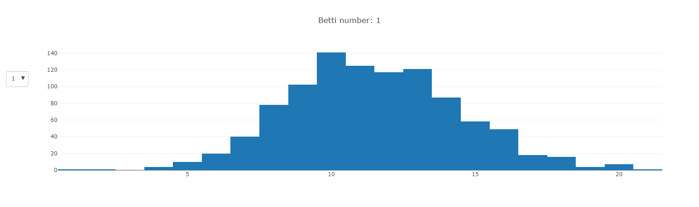

# Simplicial Topology
A Rust library for working with simplicial complexes.

## Overview
This library provides tools for constructing and manipulating simplicial complexes in Rust. The main data type is `SimplicialComplex`, which represents a simplicial complex as a collection of facets of various dimensions. This has the benefit of being the most memory efficient representation of a simplicial complex.

The ability to generate multiple different models of random simplicial complexes comes ready out of the box with this library.

## Features
- A simplex is represented as a vector with some additional structure (boundary etc.).
- Construct simplicial complexes from a vector of simplexes (or a vector of vectors).
- Compute boundary matrices and betti numbers
- Generate random simplicial complexes. The following models are currently included [Linial-Meshulam](https://link.springer.com/article/10.1007/s00493-006-0027-9), [Lower](https://link.springer.com/chapter/10.1007/978-3-319-31580-5_6), [Upper](https://www.worldscientific.com/doi/10.1142/S1793525320500387) and [Pure](https://arxiv.org/pdf/1806.04566.pdf).

## Usage
### Basic Setup
To use `simplicial-topology` in your Rust project, add the following to your `Cargo.toml`:

```toml
[dependencies]
simplicial_topology = {version = "0.1.0", features = ["sc_plot"]}
# sc_plot is an optional feature for being able to plot histograms for random complex Betti numbers
```

### Basic Usage
```rust
use simplicial_topology::{sc, simplicial_complex::SimplicialComplex};

let sc = SimplicialComplex::new_from_vec(vec![vec![0, 1], vec![1, 2], vec![1, 2, 3], vec![3, 4], vec![1, 3, 4]]);
let _sc = sc![vec![0, 1], vec![1, 2], vec![1, 2, 3], vec![3, 4], vec![1, 3, 4]]; // Note this is the shorthand macro to construct an identical SimplicialComplex to sc
assert_eq!(sc, _sc);

println!("The complex has {} facets", sc.facets.len()); // This will output "The complex has 3 facets"
println!("The complex has dimension {}", sc.dimension()); // This will output "The complex has dimension 2"

```
### Betti Numbers
```rust
use simplicial_topology::sc;

let mut sc = sc![vec![1,2], vec![2,3], vec![1,3], vec![1,4], vec![4,5], vec![1,5]]; // This is the wedge of two simplicial circles (bdy of [1,2,3] and bdy of [1,4,5])
sc.add_simplex(simplex![1,4,5]); // Here we add in the simplex [1,4,5] filling in a circle. If the boundary of this simplex didn't exist then add_simplex would panic
println!("Betti vector: {:?}", sc.betti_numbers()); // This will output "Betti vector: [1, 1, 0]"
println!("Euler characteristic: {}", sc.euler_characteristic()); // This will output "Euler characteristc: 0
```
Note that we could construct the original `sc` above slightly more neatly:
```rust
use simplicial_topology::{simplex, simplicial_complex::SimplicialComplex};

let sigma: Facet = simplex![1,2,3];
let tau: Facet = simplex![1,4,5];
let sc: SimplicialComplex = sigma.boundary_as_complex().union(&tau.boundary_as_complex()); // boundary_as_complex() returns the boundary of the simplex but as a SimplicialComplex, rather than Vec<Facet>
```
The above is especially helpful when we want to interact with large simplicial spheres.

### Random Complexes
```rust
use simplicial_topology::simplicial_complex::random_simplicial_complex::{generate_random_simplicial_complex, Model};

let model = Model::LinialMeshulam {num_vertices: 20, dimension: 4, prob: 0.314159265};
let sc = generate_random_simplicial_complex(model);

assert_eq!(sc.contains_full_k_skeleton(3), true); // This is by definition true for this Linial-Meshulam random complex
```
The available model types are all derived from constructing a random hypergraph (random collection of vectors from a given vertex set) and then applying upward or downward closure.
```rust
pub enum Model {
    Lower {num_vertices: usize, prob_vec: Vec<f64>},
    Upper {num_vertices: usize, prob_vec: Vec<f64>},
    LinialMeshulam {num_vertices: usize, dimension: usize, prob: f64},
    Pure {num_vertices: usize, dimension: usize, prob: f64, include_all_vertices: bool}
}
```


We can generate and plot the distribution of Betti numbers of a random simplicial complex. The below code returns an interactive plotly Histogram. The `sc_plot` feature must be added to Cargo.toml for this functionality.
```rust
use simplicial_topology::simplicial_complex::random_simplicial_complex::{generate_many_random_betti_numbers, Model};
use simplicial_topology::graphics::plot::betti_number_histogram;

let n: usize = 20;
let prob_vec: Vec<f64> = vec![1.0, 1.0/(n as f64).powf(0.5), 1.0];
let model = Model::Lower {num_vertices: n, prob_vec: prob_vec };

let betti_numbers: Vec<Vec<i32>> = generate_many_random_betti_numbers(1000, model);
println!("{:?}", betti_numbers);
let plot = betti_number_histogram(&betti_numbers);
```


### Other Operations
Below gives simple examples for a bunch of other operations that can be chained together to form new complexes, or to get properties of an existing complex.
```rust
use simplicial_topology::{sc, simplex, simplicial_complex::SimplicialComplex};

let sc1 = sc![vec![1,2,3]];
let sc2 = simplex![2,3,4].boundary_as_complex();
sc1.dimension(); // 2
sc2.dimension(); // 1
sc1.intersection(&sc2); // sc![vec![2,3]]);
sc1.union(&sc2); // sc![vec![1,2,3], vec![3,4], vec![2,4]]
sc1.link(&simplex![2]); // sc![vec![1,3]]
sc2.star(&simplex![2]); // sc![vec![2,3], vec![2,4]]
sc2.add_simplex(simplex![2,3,4]); // sc![vec![2,3,4]], will change sc2 in place
sc1.add_simplex(simplex![2,3,4]); // panics as the boundary of this simplex is not in sc1
sc1.k_skeleton(1); // sc![vec![1,2], vec![1,3], vec![2,3]]
sc2.kth_betti_number(1);; // 1
sc1.is_connected(); // True
sc![vec![1,2,3], vec![4]].is_connected(); // False
sc![vec![1,2,3], vec![4]].alexander_dual(); // sc![vec![1,2], vec![1,3], vec![2,3]] - the dual complex X* on [n] where \sigma is a face iff [n] - \sigma is not a face in X
```

## Limitations
As is standard in a lot of simplicial complex libraries, homology (or rather Betti numbers), are computed over $\mathbb{Z}/2\mathbb{Z}$. This is a cop out for keeping track of orientations.

Currently the basis of the homology group isn't tracked, so for example we know that the complex `sc![vec![1,2], vec![1,3], vec![2,3]]` has $1$st Betti number equal to $1$ but not that cycle is generated by `<[1,2], [1,3], [2,3]>`.

Accessing $k$-dimensional faces of a complex is slower than it may be for other libraries. This is because only the facets are stored in memory, so if we requires other faces they need to be computed on the fly.